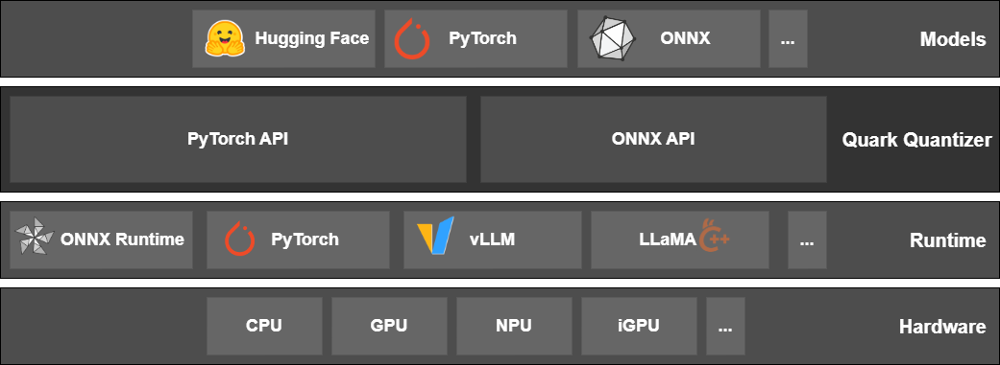

.. Quark documentation master file, created by
   sphinx-quickstart on Fri Mar 15 17:12:07 2024.
   You can adapt this file completely to your liking, but it should at least
   contain the root `toctree` directive.

Welcome to Quark's documentation!
=================================

**Quark** is a comprehensive cross-platform deep learning toolkit designed to simplify and enhance the quantization
of deep learning models. Supporting both PyTorch and ONNX models, Quark empowers developers to optimize their models for
deployment on a wide range of hardware backends, achieving significant performance gains without compromising accuracy.

Quark for PyTorch: Flexible and Efficient Quantization for PyTorch Models
-------------------------------------------------------------------------

Quark for PyTorch provides developers with a flexible, efficient, and easy-to-use toolkit for quantizing deep learning
models from PyTorch. The current quantization method is based on PyTorch in-place operator replacement.
In particular, the tool provides the key features and verified models as below:

Key Features
^^^^^^^^^^^^

* **Comprehensive Quantization Support**:
   - **Eager Mode Post-Training Quantization (PTQ):** Quantize pre-trained models without the need for retraining data.
   - **FX Graph Mode PTQ and Quantization-Aware Training (QAT):** Optimize models during training for superior accuracy on quantized hardware.
   - **Optimized QAT Methods:** Support Trained Quantization Thresholds For Accurate And Efficient Fixed-Point Inference Of Deep Neural Networks (TQT), Learned Step Size Quantization (LSQ) for better QAT result.
   - **Flexible Quantization Strategies:** Choose from symmetric/asymmetric, weight-only/static/dynamic quantization, and various quantization levels (per tensor/channel) to fine-tune performance and accuracy trade-offs.
   - **Extensive Data Type Support:** Quantize models using a wide range of data types, including `float16`, `bfloat16`, `int4`, `uint4`, `int8`, `fp8 (e4m3fn and e5m2)`, Shared Micro exponents with Multi-Level Scaling (`MX6`, `MX9`), and `Microscaling (MX)` data types with `int8`, `fp8_e4m3fn`, `fp8_e5m2`, `fp4`, `fp6_e3m2`, and `fp6_e2m3` elements.
   - **Configurable Calibration Methods:** Optimize quantization accuracy with `MinMax`, `Percentile`, and `MSE` calibration methods.
* **Advanced Capabilities:**
   - **Large Language Model Optimization:** Specialized support for quantizing large language models with `kv-cache` quantization.
   - **Cutting-Edge Algorithms:** Leverage state-of-the-art algorithms like `SmoothQuant`, `AWQ`, and `GPTQ` for `uint4` quantization on GPUs, achieving optimal performance for demanding tasks.
* **Seamless Integration and Deployment:**
   - **Export to multiple formats:** Export quantized models to `ONNX`, `JSON-safetensors`, and `GGUF` formats for deployment on a wide range of platforms.
   - **APL Integration:** Seamlessly integrate with AMD Pytorch-light (APL) for optimized performance on AMD hardware, to provide `INT-K`, `BFP16`, and `BRECQ` support.
   - **Experimental Brevitas Integration:** Explore seamless integration with Brevitas for quantizing Stable Diffusion and ImageNet classification models.
* **Examples included:** Benefit from practical examples for LLM models, SDXL models (Eager Mode), and CNN models (FX Graph Mode), accelerating your quantization journey.
* **Cross-Platform Support:** Develop and deploy on both Linux (CPU and GPU) and Windows (CPU mode) operating systems.

Quark for ONNX: Streamlined Quantization for ONNX models
--------------------------------------------------------

Quark for ONNX leverages the power of the ONNX Runtime Quantization tool,
providing a robust and flexible solution for quantizing ONNX models.

Key Features
^^^^^^^^^^^^

* **Comprehensive Quantization Support**:
   - **Post-Training Quantization (PTQ):** Quantize pre-trained models without the need for retraining data.
   - **Flexible Quantization Strategies:** Choose from symmetric/asymmetric, weight-only/static/dynamic quantization, and various quantization levels (per tensor/channel) to fine-tune performance and accuracy trade-offs.
   - **Extensive Data Type Support:** Quantize models using a wide range of data types, including `uint32`, `int32`, `float16`, `bfloat16`, `int16`, `uint16`, `int8`, `uint8`, Block Floating Point (typical `BFP16`), and `Microscaling (MX)` data types with `int8`, `fp8_e4m3fn`, `fp8_e5m2`, `fp4`, `fp6_e3m2`, and `fp6_e2m3` elements.
   - **Configurable Calibration Methods:** Optimize quantization accuracy with `MinMax`, `Entropy`, `Percentile`, `NonOverflow` and `MinMSE` calibration methods.
* **Advanced Capabilities:**
   - **Multiple Deployment Targets:** Target a variety of hardware platforms, including `NPU_CNN`, `NPU_Transformer`, and `CPU`.
   - **Cutting-Edge Algorithms:** Leverage state-of-the-art algorithms like `SmoothQuant`, `CLE`, `BiasCorrection`, `AdaQuant`, `AdaRound`, and `GPTQ` achieving optimal performance for demanding tasks.
   - **Flexible Scale Types:** Support quantization with `float scale`, `int16 scale`, and `power-of-two scale` options.
   - **Automatic Mixed Precision:**  Achieve an optimal balance between accuracy and performance through automatic mixed precision.

.. toctree::
   :hidden:
   :caption: Release Notes
   :maxdepth: 1

   Release Information <release_note.rst>

.. _getting-started-with-quark:
.. toctree::
   :hidden:
   :caption: Getting Started with Quark
   :maxdepth: 1

   .. _introduction-to-quantization:
   Introduction to Quantization <intro.rst>

   .. _installation:
   Installation <install.rst>

   .. _basic-usage:
   Basic Usage <basic_usage.rst>

   .. _accessing-pytorch-examples:
   Accessing PyTorch Examples <pytorch/pytorch_examples.rst>

   .. _accessing-onnx-examples:
   Accessing ONNX Examples <onnx/onnx_examples.rst>

.. _advanced-quark-features-pytorch:
.. toctree::
   :hidden:
   :caption: Advanced Quark Features for PyTorch
   :maxdepth: 1

   .. _configuration:
   Configuring PyTorch Quantization <pytorch/user_guide_config_description.rst>

   .. _torch-calibration-methods:
   Calibration Methods <pytorch/calibration_methods.rst>

   .. _torch-calibration-datasets:
   Calibration Datasets <pytorch/calibration_datasets.rst>

   .. _torch-quantization-strategies:
   Quantization Strategies <pytorch/quantization_strategies.rst>

   .. _torch-quantization-schemes:
   Quantization Schemes <pytorch/quantization_schemes.rst>

   .. _torch-quantization-symmetry:
   Quantization Symmetry <pytorch/quantization_symmetry.rst>

   .. _quark-for-language-models:
   Language Model Optimization <pytorch/llm_quark.rst>

   .. _exporting-quantized-models:
   Exporting Quantized Models <pytorch/user_guide_output.rst>

   .. _exporting-using-onnx-runtime-gen-ai-model-builder:
   Exporting Using ONNX Runtime Gen AI Model Builder <pytorch/exporting_onnx.rst>

   .. _smoothquant:
   Activation/Weight Smoothing (SmoothQuant) <pytorch/smoothquant.rst>

   .. _quark-extensions:
   Extensions <pytorch/extensions.rst>

   .. _using-mx-with-quark:
   Using MX (Microscaling) <pytorch/adv_mx.rst>

   .. _two-level-quantization-formats:
   Two Level Quantization Formats <pytorch/adv_two_level.rst>

.. _advanced-quark-features-onnx:
.. toctree::
   :hidden:
   :caption: Advanced Quark Features for ONNX
   :maxdepth: 1

   .. _onnx-configuration:
   Configuring ONNX Quantization <onnx/user_guide_config_description.rst>

   .. _onnx-calibration-methods:
   Calibration methods <onnx/config/calibration_methods.rst>

   .. _onnx-calibration-dataset:
   Calibration datasets <onnx/config/calibration_datasets.rst>

   .. _onnx-quantization-strategies:
   Quantization Strategies <onnx/config/quantization_strategies.rst>

   .. _onnx-quantization-schemes:
   Quantization Schemes <onnx/config/quantization_schemes.rst>

   .. _onnx-quantization-symmetry:
   Quantization Symmetry <onnx/config/quantization_symmetry.rst>

   :_data-types:
   Data and OP Types <onnx/config/supported_types.rst>

   .. _onnx-mixing-precision:
   Mixed Precision <onnx/tutorial_mix_precision.rst>

   .. _onnx-bfp-16:
   Block Floating Point 16 (BFP16) <onnx/bfp16.rst>

   .. _onnx-mx:
   Microscaling (MX) <onnx/tutorial_mx_quantization.rst>

   .. _onnx-accuracy-improvement-algorithms:
   Accuracy Improvement Algorithms <onnx/accuracy_improvement_algorithms.rst>

   .. _onnx-optional-utilities:
   Optional Utilities <onnx/optional_utilities.rst>

   .. _onnx-tools:
   Tools <onnx/tools.rst>

.. _apis:
.. toctree::
   :hidden:
   :caption: APIs
   :maxdepth: 1

   .. _pytorch-apis:
   PyTorch APIs <pytorch/pytorch_apis.rst>

   .. _onnx-apis:
   ONNX APIs <onnx/onnx_apis.rst>

.. _troubleshooting-and-support:
.. toctree::
   :hidden:
   :caption: Troubleshooting and Support
   :maxdepth: 1

   .. _pytorch-faq:
   PyTorch FAQ <pytorch/pytorch_faq.rst>

   .. _onnx-faq:
   ONNX FAQ <onnx/onnx_faq.rst>
