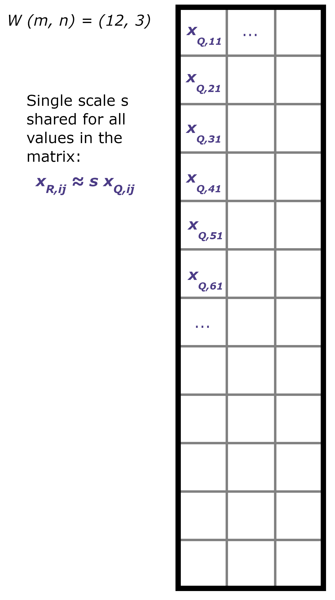
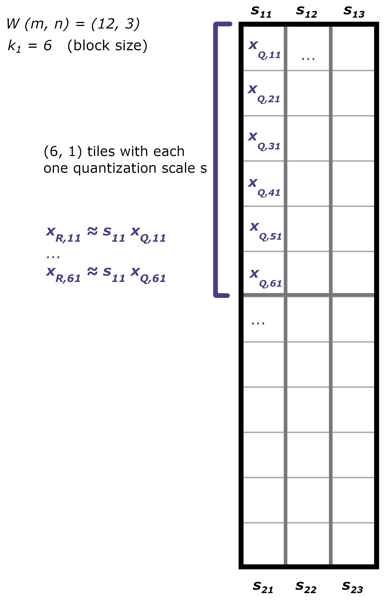
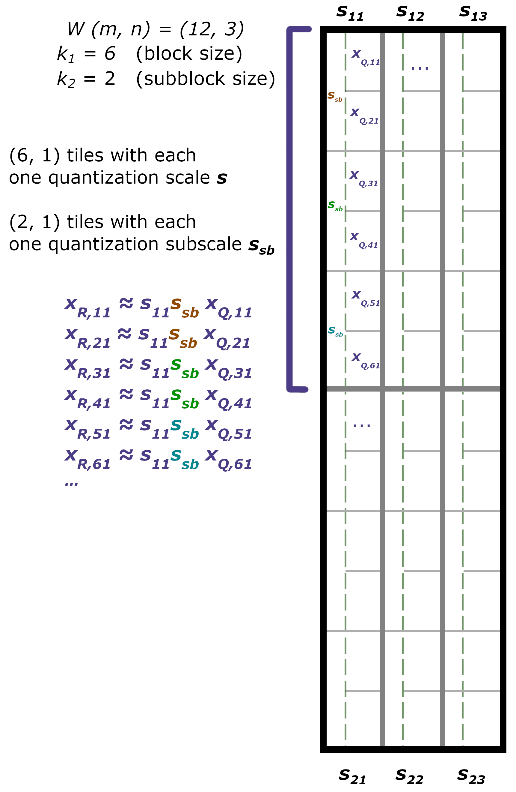
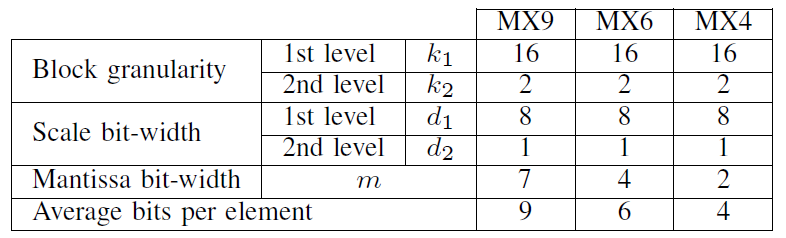

Two level quantization formats (MX4, MX6, MX9: shared MicroeXponents)
=====================================================================

Quark supports through ``quark.torch`` the MX6 and MX9 quantization formats that were introduced in `With Shared Microexponents, A Little Shifting Goes a Long Way <https://arxiv.org/abs/2302.08007>`__.

The novelty of these quantization formats lies in the way quantization scales are computed and stored. For a general quantization introduction and how it is used in Quark, please refer to the :doc:`Quantization with Quark <./quantization>` documentation.

Context: uniform integer quantization
~~~~~~~~~~~~~~~~~~~~~~~~~~~~~~~~~~~~~

When we apply quantization, we typically are looking to use a lower number of bits per weight of a high precision matrix :math:`W` of shape :math:`[m, n]`, that is originally in float32, float16 or bfloat16 precision. A classic quantization technique is uniform integer quantization, for example INT8 quantization, which uses the following scheme:

.. math::

    x_Q &= \text{round}(\frac{x_R}{s}) \in [-128,-127,...,127] \\
    x_R &= s \times x_Q \hspace{3ex}\text{(float value).}

Here, :math:`s` is called the **scale** factor, :math:`x_Q` represents a quantized value (e.g. an int8 value), and :math:`x_R` represents the high precision value (typically float16, bfloat16 or float32).

   Uniform integer per-tensor quantization.

Such a quantization scheme necessarily leads to quantization error. To preserve the model prediction quality, a strategy is to allow more granular scales. For example, instead of computing a single scale :math:`s` for the whole matrix :math:`W`, we may increase the granularity by computing one scale per column, or even one scale per group of size :math:`k` within a column, as shown as an example below.

   Per-block quantization, with the block size :math:`k_1 = 6`.

Effectively, increasing this granularity amounts to taking into account only a subset of values from :math:`W` so as to compute the relevant scale :math:`s` for this subset of values.

A second strategy to balance the quantization error with the number of bits per weight is to use a different data type to store the scales. A common approach is to store scales as float16 or float32 values, but we could well **constrain** scales to be powers of two, implementing the dequantization operation :math:`s \times x_Q` as a simple bit shift (similarly for quantization operation). Thus, instead of storing the scale :math:`s` on 16 or 32 bits, we may store it on a lower bitwidth, e.g. 8 bits.

Two-level quantization: MX6 and MX9 data types
~~~~~~~~~~~~~~~~~~~~~~~~~~~~~~~~~~~~~~~~~~~~~~

The proposed MX6 and MX9 data types play on both the granularity of the scale factors, and the precision allocated to them in order to:

- Minimize the number of bits per weights
- Minimize the degradation in predictive performance due to quantization
- Be hardware friendly

To achieve these goals, the classic quantization scheme :math:`x_R = s \times x_Q` is decomposed into

.. math::
    x_R = s_b \times s_{sb} \times x_Q

where :math:`s_b` stands for the block scale (1st level), and :math:`s_{sb}` stands for the subblock scale (2nd level).

   A dummy example for a two-level quantization scheme, with the block size :math:`k_1 = 6`. The different colors for :math:`s_{sb}` indicate different values per subblock.

   MX9, MX6 and MX4 specifications from `[1] <https://arxiv.org/abs/2302.08007>`__.

For example for the MX9 data type, the block scale :math:`s_b` is an 8-bit (:math:`d_1 = 8`) power of two (within :math:`[2^{-127}, ..., 2^{127}]`) scale, shared over :math:`k_1 = 16` values, while the subblock scale :math:`s_{sb}` is a 1-bit (:math:`d_2 = 1`) power of two scale (effectively, :math:`2^{0}` or :math:`2^{-1}`) shared over :math:`k_2 = 2` values.

The mantissa bit-width :math:`m` stands for the number of bits used to store the quantized value :math:`x_Q`, which is effectively using :math:`2^m` possible different bins.

The total number of bits per value is

.. math::
    (m + 1) + \frac{d_1}{k_1} + \frac{d_2}{k_2}

where :math:`m + 1` accounts for the sign bit and the :math:`m` bits for storing :math:`x_Q`, and where the two other terms split the storing cost of :math:`s_b` and :math:`s_{sb}` over the values within the block and subblock.

The intuition behind this quantization scheme is that while we allow ourselves to store a few block scales :math:`s_b` that are in relative high precision (8 bits per scale per block of 16 values), we also store many more subscales :math:`s_{sb}` (with :math:`k_2 = 2`, half the number of values in our matrix) that allow to have a lower quantization error for each floating points values in subblocks, but as this subscales uses a very low bitwidth (1 bit), it is a storage (and compute - as bit shifts are used) cost we can afford.

How are these two-level scales obtained?
~~~~~~~~~~~~~~~~~~~~~~~~~~~~~~~~~~~~~~~~

Several strategies can be chosen, as long as they respect the constraints put on the scales and sub-scales. 
In Quark, this can be found at `quark/torch/kernel/hw_emulation/hw_emulation_interface.py`, the scales and sub-scales are computed as follow (taking MX9 as example):

1. From the original float32, bfloat16 or float16 :math:`W` matrix, retrieve the maximum power of two exponent of each block of size :math:`k_1 = 16`, denoted :math:`e_{b,max}`. This can be retrieved from the exponent bits from the floating point representation :math:`(-1)^s2^e \times 1.m`.
2. For each subblock of :math:`k_2 = 2` values within the block, find out whether both floating points values have an exponent strictly smaller than :math:`e_{b,max}`.

    - If that is the case, we have comparatively small values within the block - hence we want to have **a smaller scale**, which amounts to a smaller quantization range and finer quantization of small values. We choose :math:`s_{sb} = 2^{-1}`.
    - If that is not the case, we choose :math:`s_{sb} = 1` (no bit shift, no subscale really applied).
3. The block scale is chosen as :math:`s_b = 2^{e_{b,max} - 8 + 2}`, where the :math:`2^{-(8 - 1 - 1)}` term is an implementation detail accounting for the hidden bit of floating point numbers, and base 2 to base 10 conversion of the mantissa :math:`(1.m)_2` [1]_.

Finally, the global scale for a subblock of two values is :math:`s = s_b \times s_{sb} = 2^{e_{b,max} - 8 + 2} \times 2^{(\text{-1 or 0})}`.

Hardware mapping
~~~~~~~~~~~~~~~~

Why is this quantization scheme interesting at all, in terms of mapping it to the hardware?

One element is that scaling can be implemented as bit shifts, both for the block scales and subblock scales as these are stored as powers of two.

..
    TODO: complete with more details.

Notes
~~~~~

.. [1] In short, for MX9: :math:`(1.m)_2 = 2^1 \times (0.m)_2 = 2^1 \times 2^{-7} \times m_{10}`, where subscripts represent the base 2 and 10.
