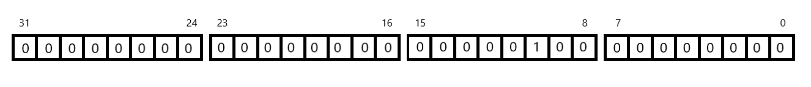
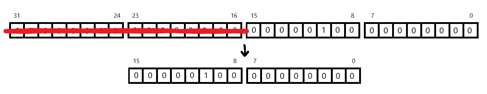
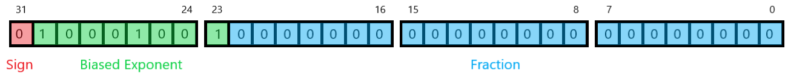
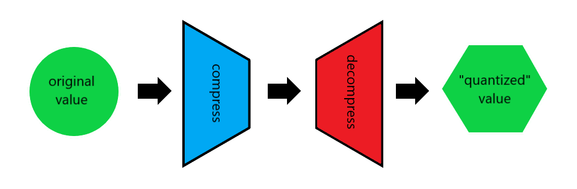
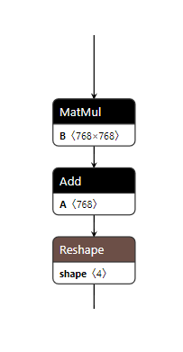
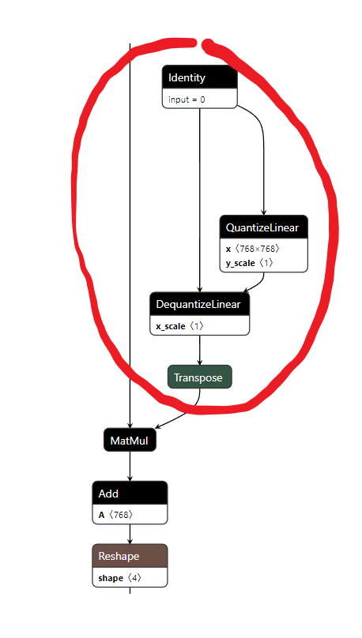
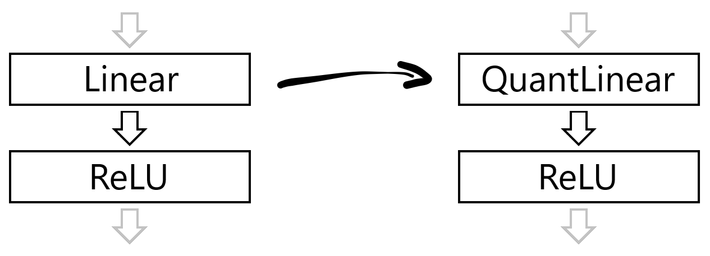

Quantization with Quark
=======================

What is quantization?
---------------------

Quantization is the compression of a number from a higher bit width representation into a lower bit width representation.

To give a simple example, take the number 1024.

In the form of a typical integer value (which would be 32-bits or 4 bytes) its memory representation would be:

We can see over 2 bytes of memory (bits 31 to 11) are being used to store zeros, we could convert this number to a 16-bit integer type with no loss of information and use half the memory:

This is quantization and if we apply this to a neural network, it means we can use smaller models, running on cheaper hardware at potentially faster speeds than their original full sized versions!

However, it usually isn't that simple.

Numbers are often in decimal format which generally uses a standard known as IEEE-754 floating point and we can't just strip a few bytes off these more complicated data types.

To illustrate this, let's represent 1024 in 32-bit floating point:

It is no longer so clear where we can remove bits to compress the value.

In fact there are a lot of things to consider when quantizing: 

- It may be a **lossy** compression where we irrecoverably lose precision, perhaps 1024.23 may have to be converted to 1024.0 or 1024.5 at a lower bit width.
- The result of arithmetic using quantized values may **overflow** and require a larger bit width to hold the value e.g. 255 can be held in 8 bits (``1111 1111``) but 255*2 = 510 requires 9 (``1 1111 1110``). 
- There are lots of different data types we can quantize values to such as 16 to 4 bit integers, 16 to 4 bit floating points and even newer exotic composite types like MX.

This is why we want to use a library like **Quark** which can handle all these details for us.

Model Quantization
------------------

In case of deep learning models, quantization is the process of converting the weights and activations of the model from floating point to a lower bit width float or integer representation.
This can significantly reduce the memory footprint and computational requirements of the model, making it more efficient to run on hardware that supports these lower bit width data types.
While it impacts the model accuracy, achieving a balance between accuracy and performance is the key to successful quantization.

Model quantization techniques can be broadly classified into two categories:

- Quantization-aware training (QAT): Integrates quantization into the training process to minimize the accuracy loss due to quantization.
- Post-training quantization (PTQ): This method quantizes the model after training, without retraining the model.

PTQ is a popular method for quantizing pre-trained models as it does not require retraining the model and can be applied to any pre-trained model. However, it may result in a loss of model accuracy due to the quantization process. 
**Quark** helps restore model accuracy that may be lost after quantization through various post training quantization techniques.

The quantization representation of the model can be broadly classified into two categories:

- Quantization to low bit float precision i.e. conversion from float32 to float16/bfloat16/float8.
- Quantization to integer precision i.e. conversion from float32/float16 to int8/int4.

When converting to low bit float precision the data is still stored in similar floating point format but with a lower bit width. This can be useful when the hardware supports these lower bit width floating point data types.

When converting to integer precision, the data is mapped into integers data range. This can be useful when the hardware supports integer data types and can perform operations on them more efficiently than floating point data types.

Integer Quantization
~~~~~~~~~~~~~~~~~~~~

The process of mapping real numbers to integers requires you to computer quantization parameters that are defined as scale and offset. These can be represented through the following equations:

Quantization:

   ::

      q = round(r/s + z)

Dequantization:

   ::

      r = (q - z) * s

where 'q' is the quantized value, 'r' is the real value, 's' is the scale and 'z' is the offset. 

These quantization parameters are computed by observing the real values of the tensor and finding the minimum and maximum values of the tensor. The scale and offset are then computed based on these minimum and maximum values.

**Quark** provides different algorithms that allow you tune these quantization parameters to achieve the desired accuracy trade-offs.

Based on the values of these quantization parameters, the quantization can be classified as Symmetric quantization where z = 0 or asymmetric quantization where z != 0.

Moreover, the quantization can be classified as per-tensor/per-channel/per-group depending on how the quantization parameters (scale and offset) are calculated for the elements of the tensor.

**Quark** supports different quantization schemes across different frameworks. For more details refer to Quark PyTorch/ONNX user guide.

Fake Quantization
-----------------

In order to make it easier to manipulate the quantized model and allow support for data types that may not have hardware level support, **Quark** uses a technique known as *simulated quantization* or as it's more popularly, and confusingly, known, *fake quantization*.

So when we perform quantization in **Quark**, the values aren't actually being directly quantized, they are being **fake quantized**.

What does this mean?
~~~~~~~~~~~~~~~~~~~~

It means values are not immediately cast to their newly quantized data types. A 32-bit weight is not now stored as an 8-bit integer in memory for example. Under the surface it is still stored in its original bit width, for the moment.

Instead the quantization is simulated by compressing the value down and then decompressing it back up into its original width. The result will be at the original bit width but the value itself will be one that can be represented by a lower bit width data type.

This means that if we want to perform inference on the quantized model in **Quark**, the operations will be performed at the higher bit width (so no hardware support for the quantized data type will be required) but the results will be representative of the accuracy we can expect when the quantization is finalised.

When are values actually converted into their quantized data types?
------------------------------------------------------------------

In the `pytorch quantization libraries <https://docs.pytorch.wiki/en/generated/torch.quantization.convert.html>`__ we would explicitly force the quantization to be applied with a function call.

Quark instead is built around exporting what is known as a QDQ (or Quantize-DeQuantize) model.

For example, if the unquantized model contained the following nodes:

the quantized model exported from **Quark** might look like this:

with explicit quantize and dequantize nodes inserted. The weights etc are still stored in their original unquantized form but these new nodes recreate the fake quantization process.

This means that whatever tool later consumes this model will have to collapse down the nodes and make the quantization final but an advantage of this approach is the model can run as is, even without **Quark** installed at this point.

What happens internally in Quark when we quantize something?
-------------------------------------------------------------

When we pass a model into **Quark** to be quantized, one of the first things it does is replace certain layers with **Quark** equivalents.

At the moment there are alternative quantized layers for: 

- Linear
- Conv2d

when **Quark** sees either of these layer types it replaces them with a *Quant* version such as QuantLinear or QuantConv2d.

Depending on the quantization configuration selected, these new layers can intercept the inputs, outputs, biases and weights with *fake quantized* versions.

The calibration data provided to **Quark** when initializing the quantizer is then passed through the model.

A user definable observer such as:

- PerTensorMinMaxObserver 
- PerChannelMinMaxObserver 
- PerBlockMXObserver 
- etc

is fed this data as it goes through the model to calculate representative minimum and maximum values needed to correctly quantize the data.

.. raw:: html

   <!-- 
   ## License
   Copyright (C) 2023, Advanced Micro Devices, Inc. All rights reserved. SPDX-License-Identifier: MIT
   -->
