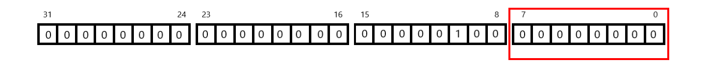

AMD Quark Tutorial: PyTorch Quickstart
======================================

This tutorial follows on from PyTorch’s own
`QuickStart <https://pytorch.org/tutorials/beginner/basics/quickstart_tutorial.html>`__
documentation, and is designed for brand new users to PyTorch and AI,
who might have done just a few machine learning tutorials, and are
interested in learning about quantization for compressing AI models.

Don’t worry if you’re not an expert! The goal here to to *learn by
doing*, and to have a bit of fun visualizing things as we go. We’re
going to introduce theory and new concepts as we build things in
Notebooks.

What You Will Learn
-------------------

- AMD Quark basic installation.
- How to use Quark to quantize the weights of a model in PyTorch.
- How to compare the model’s accuracy before and after quantization.
- Checking if the quantized model still correctly detects your
  hand-drawn shoe image!

Installation and Set-Up
-----------------------

Quark and Dependencies
~~~~~~~~~~~~~~~~~~~~~~

Let’s create a Python environment for this tutorial, and install PyTorch
and Quark. You can refer to the `Recommended First Time User
Installation <https://quark.docs.amd.com/latest/install.html>`__ to get
Quark, and its dependencies, set up quickly. If you’re on Windows, we do
recommend using Ubuntu *via* WSL (Windows Subsystem for Linux) through
the *Terminal* application for your first projects.

For example; I have a Windows 11 machine:

1. I installed *Ubuntu*, and *Windows Terminal* from the *Microsoft
   Store* application.
2. I then opened the Terminal application, and an Ubuntu tab in it.
3. In Ubuntu I installed
   `Miniforge <https://github.com/conda-forge/miniforge>`__.
4. I then created an environment for these notebooks,
5. And installed the rest of the dependencies listed in the Recommended
   First Time User Installation guide, above.

Note that the ``build-essential`` package installs a C++ compiler on the
main path in Ubuntu, not within our Python environment. We need the C++
compiler later in this tutorial for compiling Quark *kernels*. That step
is just a little trickier to set up outside of Ubuntu, so using WSL is
going to save us some fuss for our first tutorial.

Jupyter Notebook
~~~~~~~~~~~~~~~~

If you haven’t done so already, you can install Jupyter Notebook into
your Python environment, and the very useful visualization package
``matplotlib``, which we will use in this tutorial:
``pip install notebook matplotlib``.

Define Directory to Reuse Data
~~~~~~~~~~~~~~~~~~~~~~~~~~~~~~

Machine learning models, and the input data for training and testing
them, can get very large, especially if we have multiple copies on the
same machine. Let’s set a sensible location for downloading and loading
our models. Be careful not to put this on a shared or cloud-synced
folder. If you are on a machine with multiple users, this might be a
directory everyone can access.

I’m going to use an environment variable called ``LOCAL_MODEL_CACHE``
that I have defined offline for our server, but you can put any path
here.

.. code:: ipython3

    import os
    if os.environ.get('LOCAL_MODEL_CACHE') is not None:
        data_path = os.environ['LOCAL_MODEL_CACHE']
    else:
        data_path = "./model_cache/"

Recap - MNIST Fashion
---------------------

If you haven’t done so already, complete the PyTorch
`QuickStart <https://pytorch.org/tutorials/beginner/basics/quickstart_tutorial.html>`__,
and the Learn the Basics series that explains the parts there. We’ll
start with the code for that completed example. Recall that this model
uses Zalando’s *FashionMNIST* version - little pictures of shoes and
t-shirts - of the very well known MNIST data set.

Let’s recreate the example. Recall that the first part downloads the
test and training set, and then splits those up into batches with the
PyTorch data loader.

.. code:: ipython3

    import torch
    from torch import nn
    from torch.utils.data import DataLoader
    from torchvision import datasets
    from torchvision.transforms import ToTensor
    
    # Download training data from open datasets.
    training_data = datasets.FashionMNIST(
        root=data_path, # Use the data path we defined earlier.
        train=True,
        download=True,
        transform=ToTensor(),
    )
    
    # Download test data from open datasets.
    test_data = datasets.FashionMNIST(
        root=data_path, # Use the data path we defined earlier.
        train=False,
        download=True,
        transform=ToTensor(),
    )
    
    batch_size = 64
    
    # Create data loaders.
    train_dataloader = DataLoader(training_data, batch_size=batch_size)
    test_dataloader = DataLoader(test_data, batch_size=batch_size)
    
    for X, y in test_dataloader:
        print(f"Shape of X [N, C, H, W]: {X.shape}")
        print(f"Shape of y: {y.shape} {y.dtype}")
        break
    
    # Determine device to use for training. Change this to match your PyTorch install.
    device = "cpu"
    
    print(f"Using {device} device")

Recall that we can use ``matplotlib`` to visualize the images in our
data set by indexing into it.

.. code:: ipython3

    import matplotlib.pyplot as plt
    
    sample_idx = 123 # Or any index you like.
    
    # The training data returns the image data, as a tensor, and a number for the label (category).
    img, label = training_data[sample_idx]
    
    # The label is an index number too, so we can map it to a string that's more intuitive to read.
    labels_map = {
        0: "T-Shirt",
        1: "Trouser",
        2: "Pullover",
        3: "Dress",
        4: "Coat",
        5: "Sandal",
        6: "Shirt",
        7: "Sneaker",
        8: "Bag",
        9: "Ankle Boot",
    }
    
    plt.title(labels_map[label])
    plt.axis("off")
    plt.imshow(img.squeeze(), cmap="gray") # The images are grayscale, so set that here to display correctly.
    plt.show()

We also defined a simple model to use.

.. code:: ipython3

    # Define model
    class NeuralNetwork(nn.Module):
        def __init__(self):
            super().__init__()
            self.flatten = nn.Flatten()
            self.linear_relu_stack = nn.Sequential(
                nn.Linear(28*28, 512),
                nn.ReLU(),
                nn.Linear(512, 512),
                nn.ReLU(),
                nn.Linear(512, 10)
            )
    
        def forward(self, x):
            x = self.flatten(x)
            logits = self.linear_relu_stack(x)
            return logits

And training and test functions.

.. code:: ipython3

    def train(dataloader, model, loss_fn, optimizer):
        size = len(dataloader.dataset)
        model.train()
        for batch, (X, y) in enumerate(dataloader):
            X, y = X.to(device), y.to(device)
    
            # Compute prediction error
            pred = model(X)
            loss = loss_fn(pred, y)
    
            # Back propagation
            loss.backward()
            optimizer.step()
            optimizer.zero_grad()
    
            if batch % 100 == 0:
                loss, current = loss.item(), (batch + 1) * len(X)
                print(f"loss: {loss:>7f}  [{current:>5d}/{size:>5d}]")

Note that I have made a small change to this function to help us collect
accuracy statistics. That’s just a return statement at the end.

.. code:: ipython3

    def test(dataloader, model, loss_fn):
        size = len(dataloader.dataset)
        num_batches = len(dataloader)
        model.eval() # Put model into evaluation mode.
        test_loss, correct = 0, 0
        with torch.no_grad():
            for X, y in dataloader:
                X, y = X.to(device), y.to(device)
                pred = model(X)
                test_loss += loss_fn(pred, y).item()
                correct += (pred.argmax(1) == y).type(torch.float).sum().item()
        test_loss /= num_batches
        correct /= size
        ## I added this section at the end to help make a comparison table later:
        print(f"Test Error: \n Accuracy: {(100*correct):>0.1f}%, Avg loss: {test_loss:>8f} \n")
        return correct, test_loss

We then ran our training and testing for a number of epochs. Note here
that we printed out the *accuracy*, and average *loss* at each epoch.
These numbers will be important to compare against later, when we have a
quantized version of this model. Remember, we can increase the number of
epochs to gain some accuracy at the expense of more training time.

- Try changing the number of epochs below to higher numbers, e.g. 5, 10,
  20. Run the code section again, and watch what happens to the accuracy
  result.

.. code:: ipython3

    model = NeuralNetwork().to(device)
    
    # Print the model structure.
    print(model)
    
    loss_fn = nn.CrossEntropyLoss()
    optimizer = torch.optim.SGD(model.parameters(), lr=1e-3)
    
    model_acc = 0
    model_loss = 0
    
    epochs = 5 ## Increase this to improve accuracy.
    for t in range(epochs):
        print(f"Epoch {t+1}\n-------------------------------")
        train(train_dataloader, model, loss_fn, optimizer)
        model_acc, model_loss = test(test_dataloader, model, loss_fn)
    print("Done!")

With 10 epochs, my model achieved 71.0% accuracy, with average loss of
0.789085.

- Record the results of each training session you run. Your numbers will
  differ from mine given the use of random numbers in creating the
  artificial neural network. We will use this as a reference later.
- In Visual Studio code, you may need to change to a “scrollable
  element” to see all of the output text.

We also saved and loaded copies of our model.

.. code:: ipython3

    torch.save(model.state_dict(), "model.pth")
    print("Saved PyTorch Model State to model.pth")

The model is saved as a serialised Python *state dictionary*, and here
is about 2MB on disk. We’ll make a quantized version of this shortly,
replacing our float weights with smaller, 8-bit integer weights. If you
imagine that most of a model’s size is from 32-bit ``float`` weights, we
could shrink it down to about 25% of the size by converting weights to
8-bit integers. That won’t matter much for our small model, but it will
give us an idea of how this might be really useful for shrinking large
gigantic language models down to more manageable sizes.

.. code:: shell

    2,681,332 model.pth

At this point we can run our model in *inference* mode to see if it can
predict an image. You can change the value of ``i``, below to see if it
is correctly classifying models from our test data.

.. code:: ipython3

    classes = [
        "T-shirt/top",
        "Trouser",
        "Pullover",
        "Dress",
        "Coat",
        "Sandal",
        "Shirt",
        "Sneaker",
        "Bag",
        "Ankle boot",
    ]
    
    model.eval()
    i = 0
    x, y = test_data[i][0], test_data[i][1]
    with torch.no_grad():
        x = x.to(device)
        pred = model(x)
        predicted, actual = classes[pred[0].argmax(0)], classes[y]
        print(f'Predicted: "{predicted}", Actual: "{actual}"')

As a computer graphics guy I thought this was a bit dry, and I wanted to
see if it could predict an image that I hand-drew for a bit of visual
feedback. You might like to give this a go. Here’s my lovely artwork for
a shoe and a t-shirt:

|anton’s shirt| |anton’s shoe|

You need to make the image in the same format at MNIST - that’s 28x28
pixels grayscale.

- Create your own 28x28 pixel grayscale image, using
  e.g. `GIMP <https://www.gimp.org/>`__, and save it as ``my_shirt.jpg``
  in the notebook directory.

Let’s just check that my sample images are on the right path, by loading
them up and displaying them with ``matplotlib``:


.. code:: ipython3

    import matplotlib.image as mpimg # For reading images from files.
    
    img1 = mpimg.imread('anton_2828_shoe.jpg')
    img2 = mpimg.imread('anton_2828_shirt.jpg')
    
    plt.axis("off")
    # Note that these images are not in a tensor, and so do not need to be "squeezed" first.
    plt.imshow(img1, cmap="gray")
    plt.show()
    plt.axis("off")
    plt.imshow(img2, cmap="gray")
    plt.show()

You can load these up easily using the ``PIL`` package, and convert them
to a tensor representation using
```ToTensor`` <https://pytorch.org/vision/main/generated/torchvision.transforms.ToTensor.html>`__.

- Uncomment the filename you wish to test against - your hand-drawn
  image is ``user_input.jpg``.
- Comment out my images and add in your own hand-drawn image filename.

.. code:: ipython3

    from PIL import Image # for loading images after training
    
    ## Choose one:
    #img = Image.open('your_28x28_image.jpg')
    img = Image.open('anton_2828_shirt.jpg')
    #img = Image.open('anton_2828_shoe.jpg')
    
    # The image data needs to be "unsqueezed" into a tensor representation.
    img_tensor = ToTensor()(img).unsqueeze(0).to(device)
    answer = torch.argmax(model(img_tensor))
    print(f'Predicted: "{classes[answer]}"')

Let’s print out our model now, and have a look at it’s structure and
data types. We’ll modify this model by quantizing it with Quark in the
next section, then print it again to spot the differences.

.. code:: ipython3

    print(model)

Quantize the Model
------------------

Now we’re going to *quantize* our model with AMD Quark, and do a
before-and-after comparison of accuracy. This is a lot like choosing a
*lossy* image compression level with a JPEG-format image.

- Quantizing a model after training is called *post-training
  quantization* (PTQ). This should compress a model, giving us both a
  smaller memory footprint and lower bandwidth for inference. But we
  expect some accuracy loss, because the values of weights will have
  changed slightly with lower precision numbers.
- It’s possible to quantize a model before training, which can reduce
  the accuracy loss. This is called *quantization-aware training* (QAT).

Quark supports both PTQ and QAT. For now we are just going to use PTQ.

Create a Quantization Configuration
~~~~~~~~~~~~~~~~~~~~~~~~~~~~~~~~~~~

We’re going to convert just the *weights* in our model from their
default, ``float`` representation, to an 8-bit ``int``. We set this in
Quark by creating a *quantization configuration*. Quark allows us to get
specific with how it should do this. For our first quantized model we
are just going to leave the *specification* for our int8 tensors set to
sensible defaults. These are given in the *examples* that ship with
Quark. If we want to squeeze the absolute most accuracy out of
quantization, it’s possible to come back and tweak the configuration and
see if it works better for a model.

.. code:: ipython3

    # Import Quark components.
    from quark.torch.quantization.config.config import Config, QuantizationConfig
    from quark.torch.quantization import Int8PerTensorSpec
    
    # Define a specification for our int8 data type with some sensible defaults; which techniques to use to convert from float to int.
    DEFAULT_INT8_PER_TENSOR_SYM_SPEC = Int8PerTensorSpec(observer_method="min_max",
                                          symmetric=True,
                                          scale_type="float",
                                          round_method="half_even",
                                          is_dynamic=False).to_quantization_spec()
    
    # Create a "quantization config" for Quark with our sensible starting parameters.
    DEFAULT_W_INT8_PER_TENSOR_CONFIG = QuantizationConfig(weight=DEFAULT_INT8_PER_TENSOR_SYM_SPEC)
    
    quant_config = Config(global_quant_config=DEFAULT_W_INT8_PER_TENSOR_CONFIG)

Create a Calibration Data Set
~~~~~~~~~~~~~~~~~~~~~~~~~~~~~

Quark needs to determine appropriate value ranges for quantization, and
it uses a *calibration* data set to do this, which should be
representative of our training and test data.

Note that some available data sets will already have specific
calibration sets for you to use, but we will quickly build our own
calibration data set from some of our test images:

.. code:: ipython3

    qmodel_acc, qmodel_loss = test(test_dataloader, model, loss_fn)
    
    print(f"Original model:  Accuracy: {(100*model_acc):>0.1f}%, Avg loss: {model_loss:>8f} \n")
    print(f"Quantized model: Accuracy: {(100*qmodel_acc):>0.1f}%, Avg loss: {qmodel_loss:>8f} \n")

.. code:: ipython3

    calib_dataloader = DataLoader(test_data, batch_size=32)

Create the Quantized Model
~~~~~~~~~~~~~~~~~~~~~~~~~~

With those two ingredients;

1. We create a Quark quantizer object giving our configuration as a
   parameter.
2. Create a quantized model, giving as parameters the original model,
   and our calibration data set loader.

.. code:: ipython3

    from quark.torch import ModelQuantizer
    
    quantizer = ModelQuantizer(quant_config)
    quant_model = quantizer.quantize_model(model, calib_dataloader)

Hopefully, you saw an output that looked like this:

::

   [QUARK-INFO]: Weight only quantization end.

   [QUARK-INFO]: Model quantization has been completed.

Test the Quantized Model Accuracy
~~~~~~~~~~~~~~~~~~~~~~~~~~~~~~~~~

Our quantized model is also a PyTorch model. We can call the same
``test()`` function we used during our training epochs, but using our
new quantized model ``quant_model``, in place of the original ``model``.

.. code:: ipython3

    qmodel_acc, qmodel_loss = test(test_dataloader, quant_model, loss_fn)
    
    print(f"Original model:  Accuracy: {(100*model_acc):>0.1f}%, Avg loss: {model_loss:>8f} \n")
    print(f"Quantized model: Accuracy: {(100*qmodel_acc):>0.1f}%, Avg loss: {qmodel_loss:>8f} \n")

Now, if we did our quantization job right we should see accuracy very
close to the original model, and very little additional loss.

Congratulations - you’ve quantized your first model!

In our small model, we will probably get away without much tweaking of
additional settings to retain almost all of our accuracy. As we move on
to more sophisticated models in the next tutorials, we will look at what
Quark features are available to minimise our accuracy lost from
quantization to smaller data types. We will need to choose different
quantization techniques to suit different types of model; language
models, vision models, and models of different sizes might require
different treatment, and we might choose to use different workflows in
Quark.

Check Our Hand-Drawn Images
~~~~~~~~~~~~~~~~~~~~~~~~~~~

And for a bit more personal feedback - is our quantized model still
accurate enough to recognise our hand-draw image, which might not be so
photo-realistic as the test images?

.. code:: ipython3

    from PIL import Image # for loading images after training
    
    ## Choose one:
    #img = Image.open('user_input.jpg')
    #img = Image.open('anton_2828_shirt.jpg')
    img = Image.open('anton_2828_shoe.jpg')
    
    img_tensor = ToTensor()(img).unsqueeze(0).to(device)
    answer = torch.argmax(quant_model(img_tensor))
    print(f'Predicted: "{classes[answer]}"')

Simulated Quantization
~~~~~~~~~~~~~~~~~~~~~~

Let’s also save the quantized model to a file.

.. code:: ipython3

    torch.save(quant_model.state_dict(), "qmodel.pth")
    print("Saved quantized PyTorch Model State to qmodel.pth")

Let’s have a look at that file - we’re expecting a saving of space
right?

========== ============
Filename   Size on disk
========== ============
model.pth  2681332
qmodel.pth 2687718
========== ============

It’s gotten slightly bigger! What have we missed?

Like similar quantizers, Quark is using a process called *fake
quantization*, or *simulated* quantization. That means it’s not actually
swapping the data types for the smaller ones and making the saving of
memory, *yet*.



   Image of a 32 bits float used to store an 8-bit integer

What’s actually happening is that the the quantizer is creating the
smaller, 8-bit, data type *within* the memory used by the original
32-bit float, leaving most of the bits unused. The values are then
*dequantized* back to ``float``\ s. This is a processed called Q/DQ or
quantize/dequantize. This lets us use the quantizer to *simulate* the
accuracy loss of swapping to that, lower-precision, data type. We can
then experiment, using the various knobs and dials in the quantizer
configuration to optimize our quantized model’s accuracy for the
quantized data type.

So we end up with a less accurate version of the model without any
memory saving? How do we actually get the bandwidth and memory saving we
want? The trick here is in Quark’s *export* flows. In the next
tutorials, we will look at different options for exporting the quantized
model to some popular formats. The export formats will include
additional data type hints to tools you’ll use at the next stage in your
workflow. These tools can then make the data type replacements. Then
you’ll get your smaller model. They can also do all sorts of additional
performance optimizations to improve the operations in your model for a
particular machine you want to run it in inference mode on.

You can read an overview of quantization in `Introduction to
Quantization <https://quark.docs.amd.com/latest/intro.html>`__.

We can print our quantized model, and compare it to the structure we saw
at the end of the previous section. What differences can we observe?

.. code:: ipython3

    print(quant_model)

- Our *Linear* layers have been changed to a new layer type called
  *QuantLinear*.

  - The shape is the same.
  - There is a new *ScaledFakeQuantize* addition that contains the
    quantization parameters; data type (int8), per-tensor scheme, scale,
    and zero-point, and a min and max range corresponding to the
    numerical range of an 8-bit integer (-128 to 127).
  - A per-tensor *observer* has collected the minimum and maximum values
    from each tensor.

With this information we can see that our quantization has worked. We
can see a single scale value has been created by Quark for each tensor,
based on each tensor’s actual maximum and minimum values. In
`Introduction to
Quantization <https://quark.docs.amd.com/latest/intro.html>`__ we read
that the quantization formula for each value is:

   ::

      q = round( r / s + z )

Where our quantized value, ``q``, is derived from the original value
``r`` by scaling by ``s`` to fit the new data range, and offsetting it
by ``z`` to center it around a “zero point”. What Quark is therefore
doing is determining the best scale for each tensor; how to squish the
actual range of values used in each tensor into the the numerical range
of the new data type.

There is no one-size-fits-all quantization configuration for best size
and accuracy. Some schemes suit different models, different data types,
and different machines, better than others. There are different options
here - the scaling, range, rounding method, per-tensor or per-group,
data type, and so on, are all choices that we might tweak in our
quantization configuration step to get the most out of a particular
model. We use Quark do some trial-and-error experimentation for better
results, or recreate *recipes* of known good results prepared by
researchers.

We can also see why our toy-sized model might be a bit larger when saved
- it has added information at each layer. With larger models, and when
we export to formats that natively support quantized data types, we will
see considerable size compression.

Troubleshooting
---------------

Kernel errors mentioning path to “cl” not found
~~~~~~~~~~~~~~~~~~~~~~~~~~~~~~~~~~~~~~~~~~~~~~~

You may also see errors like
``"AttributeError: module 'quark.torch' has no attribute 'kernel'"``

On Windows, ``cl.exe`` is the compiler & linker tool for Microsoft
Visual Studio. For your first tutorial we suggest using Ubuntu inside a
Terminal on Windows, which will use the GCC compiler instead, which will
be found on the path. If you are intending to run directly on Windows
with Visual Studio instead, then you need to install Visual Studio, as
per the `Advanced
Installation <https://quark.docs.amd.com/latest/install.html#advanced>`__
guide for Quark, and make sure that your Notebook shares the path to the
Visual Studio command line tools.

Further Reading
---------------

- `Introduction to
  Quantization <https://quark.docs.amd.com/latest/intro.html>`__. If
  you’re finding some of the process a bit mysterious, this article
  gives a good, visual, introduction to how quantizers like AMD Quark
  work with machine learning models.
- `Getting started with AMD
  Quark <https://quark.docs.amd.com/latest/basic_usage.html>`__. If
  you’re wondering what options you have for your quantization
  configuration, this page provides a table with a column of supported
  features for Quark’s PyTorch integration, as well as a comparison with
  Quark’s ONNX interface, which we haven’t covered in this tutorial.
- `Getting started: Quark for
  PyTorch <https://quark.docs.amd.com/latest/pytorch/basic_usage_pytorch.html>`__.
  If you’d like to try using Quark’s PyTorch integration with a larger
  model, this articles uses the same quantization approach as our
  tutorial, but with the Facebook opt-125m language model.
- `Installation <https://quark.docs.amd.com/latest/install.html>`__. If
  you have a GPU and would like to try running accelerated quantization,
  or would like to try installing on a different system, the *Advanced
  Installation* section covers those set-ups. Remember to specify the
  ``device`` to use in your PyTorch code, as in the `PyTorch
  Quickstart <https://docs.pytorch.org/tutorials/beginner/basics/quickstart_tutorial.html>`__.

Next Steps
----------

In the next tutorial we’re going to build a prompt-to-image generation
Notebook, visualize the output, then quantize it with different data
types and see if we can spot any quality difference in the images the
quantized models produce. We will follow on by looking at language
models and chat prompts, and exporting models from Quark for inference
runtimes outside of PyTorch.
